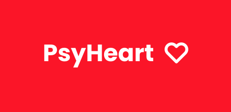
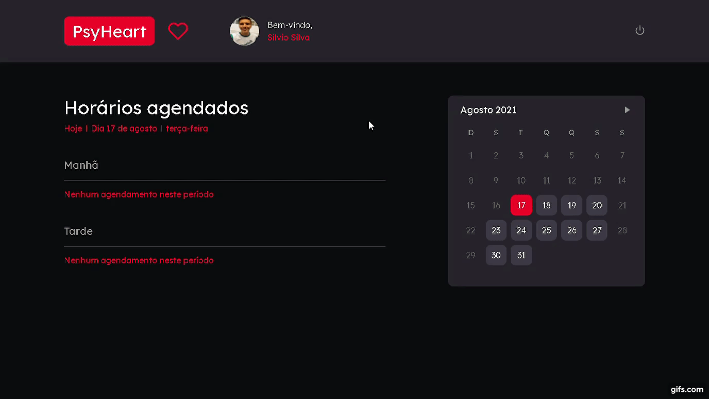

<h1 align="center">
  
</h1>

  <strong>
    🧠 PsyHeart's web platform for use by psychologists. ❤️ 
    PsyHeart is a platform that allows you to schedule an online session with a psychologist. 
    🧠 * Keep your mind aligned with your heart! * ❤️
  </strong> Practical project for study Inspired by Rocketseat's GoBarber 

  

    Access the repository for the mobile version of PsyHeart at: https://github.com/Silvio-Ronaldo/psyheart-mobile 
    Access the repository of the API version of PsyHeart at: https://github.com/Silvio-Ronaldo/psyheart-api
  
 

  
  
  
  
  
  

<h2>
  📋 Table of contents
</h2>
<ul>
  <li><a href="https://github.com/Silvio-Ronaldo/PsyHeart-web#-status">Status</a></li>
  <li><a href="https://github.com/Silvio-Ronaldo/PsyHeart-web#-how-it-works">How it works</a></li>
  <li><a href="https://github.com/Silvio-Ronaldo/PsyHeart-web#-its-paid">It's paid?</a></li>
  <li><a href="https://github.com/Silvio-Ronaldo/PsyHeart-web#%EF%B8%8F-demonstration">Demonstration</a></li>
  <li><a href="https://github.com/Silvio-Ronaldo/PsyHeart-web#-upcoming-features">Upcoming features</a></li>
  <li><a href="https://github.com/Silvio-Ronaldo/PsyHeart-web#%EF%B8%8F-technologies">Technologies</a></li>
  <li><a href="https://github.com/Silvio-Ronaldo/PsyHeart-web#-author">Author</a></li>
  <li><a href="https://github.com/Silvio-Ronaldo/PsyHeart-web#%EF%B8%8F-license">License</a></li>
</ul> 

<h2>📌 Status</h2>
<h4 align="center">🚧 PsyHeart Web is in development. 🚀</h4> 

<h2>🤔 How it works</h2>

PsyHeart's web platform is for use by psychology professionals who want to provide online care to people anywhere.

During the COVID-19 pandemic, mental and psychological health problems gained great attention from society. Even so, there is still difficulty and misinformation about the importance of consulting a psychologist.

That's why PsyHeart was created. On the professional side, just create a quick registration on the web platform, manage the days and hours of service and it will already be accessible to users who need help.

From there, the platform will work as a dashboard with all scheduled appointments, upcoming appointments and other important information so that psychologists have practicality and security in helping other people.
 

<h2>💲 It's paid?</h2>

Not! PsyHeart's proposal is to provide free care to help those in need most in these times of calamity.

Facilitating access to psychology professionals, must consider the target audience we want to help. That's why PsyHeart is free.

Remember, PsyHeart is not an employer. It's just a bridge to help in times of crisis. We do not replace traditional psychology offices or medium/long term treatments.

Before registering as a psychologist at PsyHeart, remember, here the goal is to help people who cannot afford therapy or treatment.
 

<h2>🖥️ Demonstration</h2>
<h3>PsyHeart SignUp</h3>
  

    
  
 
  
<h3>PsyHeart Dashboard</h3>
  

    
  
 
  
<h3>PsyHeart Profile</h3>
  

    
  
 
  

<h2>📆 Upcoming features</h2>

Soon, PsyHeart will have the functionality of online assistance, with video calling.
 

<h2>🛡️ Technologies</h2>

The main tools used in the development of the PsyHeart web: 

<ul>
  <li><a href="https://pt-br.reactjs.org">React</a></li>
  <li><a href="https://www.typescriptlang.org">TypeScript</a></li>
  <li><a href="https://styled-components.com">Styled Components</a></li>
  <li><a href="https://unform.dev">Unform</a></li>
  <li><a href="https://github.com/jquense/yup">Yup</a></li>
  <li><a href="https://react-day-picker.js.org">React-Day-Picker</a></li> 
  
  <li><a href="https://testing-library.com">Testing-library</a></li>
  <li><a href="https://jestjs.io/pt-BR/">Jest</a></li> 
  
  <li><a href="https://eslint.org">ESLint</a></li>
  <li><a href="https://prettier.io">Prettier</a></li>
  <li><a href="https://editorconfig.org">EditorConfig</a></li>
</ul> 

<h2>👽 Author</h2>
<table>
  <tr>
    <td align="center"><a href="https://github.com/Silvio-Ronaldo"> <b>Silvio Ronaldo</b></a> <a href="https://github.com/Silvio-Ronaldo" title="Silvio Ronaldo">🍀</a></td>
  </tr>
</table>

Leave your star, fork the project or open a pull request ❤️

Contact me on social networks: 

 

<h2>⚖️ License</h2>

<strong>PsyHeart Web is MIT licensed, as found in the <a href="./LICENSE">LICENSE file</a>.</strong>

  
  

  
  
 

